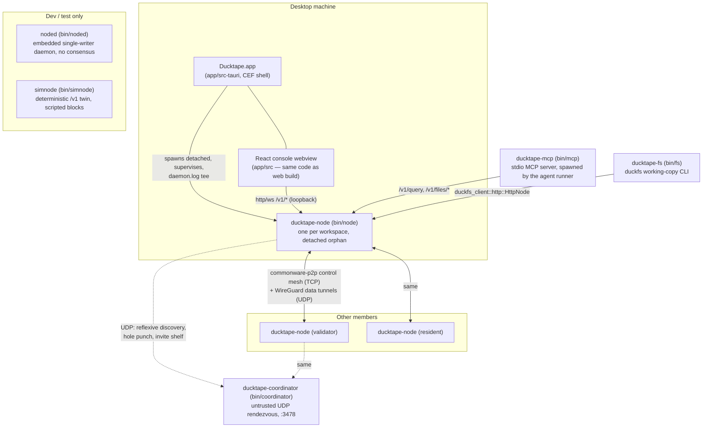
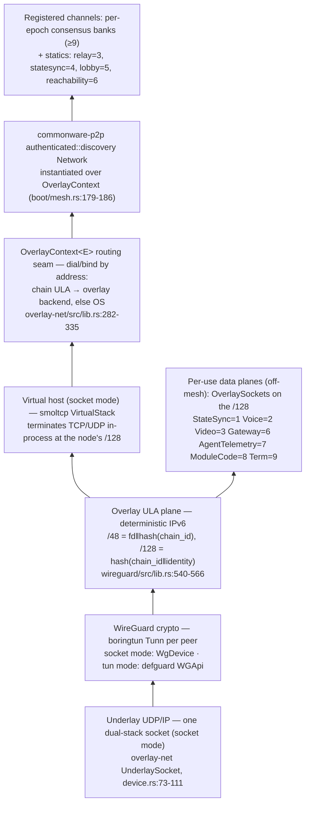

# Ducktape System Architecture — full-stack review (2026-07-16)

A top-to-bottom map of the system as it exists on `dev` at 256cd887: the process
topology, the crate hierarchy, **who owns every long-running loop**, the
network/transport stack and what kicks in when, and ordered walkthroughs of the
two flagship flows (invitation/join, transaction lifecycle). Written to be
*reviewed*: every section ends with the claims a reviewer should attack, and
§12 collects the places where docs and code currently disagree.

Companion records: `2026-07-12-crate-architecture-review.md` covers crate
*hygiene* (tier integrity, dependency edges) and is not repeated here; the
`docs/pages/en/human/architecture/*` pages carry the narrative invariants.
This document is the runtime view: processes, loops, and flows, with
`file:line` evidence.

---

## 1. What Ducktape is

One BFT-replicated state machine hosting isolated product modules — the
CosmWasm isolation *pattern* in native Rust. Each module owns its own
authenticated state substrate and exposes exactly one 32-byte
`sdk::StateRoot`; the host composes the sorted `(ModuleId, StateRoot)` pairs
into a global app-hash that consensus commits. Two nodes that agree on the
app-hash agree on every module's state.

Five invariants govern everything (`docs/pages/en/human/architecture/platform-invariants.mdx`):

1. **Isolation** — a module implements `sdk::Module`, depends only on `sdk`
   plus the *types-only* interface surface of modules it addresses, and never
   links another module's implementation.
2. **Determinism** — everything between consensus delivery and `root()` is a
   pure function of the agreed op order. No wall clock, rng, network, or LLM
   inside `execute`.
3. **Host-lent atomicity** — modules stage writes; the host calls
   `commit_block` for every touched module on a clean drain, `abort_block`
   on any failure. A failed block moves no roots.
4. **App-hash commits to everything** — every durable state that matters sits
   under some module's root.
5. **Single-store step** — a deterministic step writes one store; cross-store
   work sequences through follow-up messages or the saga/worker pattern.

---

## 2. Process topology — what actually runs

Seven binaries exist; at most four run in a normal desktop deployment.



The load-bearing facts:

- **The desktop shell spawns `ducktape-node`, not `noded`.** A workspace under
  `~/.ducktape/workspaces/<id>/` gets the bundled network-shape binary
  (`app/src-tauri/src/daemon.rs:551-597` resolves `DUCKTAPE_NODE_BIN` or the
  sibling `ducktape-node`). `noded` is the dev/web daemon
  (`cargo run -p noded`, `bin/noded/src/main.rs:1-19`); `simnode` is the
  deterministic test twin. All three serve the **byte-identical `/v1` http+ws
  surface** through the shared `noded::serve`/`noded::router` library seam
  (`bin/noded/src/lib.rs:875-891`) — "any binary that owns a host stands up
  the identical surface." This is why the React console cannot tell them
  apart, and why simnode is a usable e2e twin.
- **The node is an orphan by design.** The shell detaches it into its own
  process group (`daemon.rs:1128-1141`), tees stdout+stderr to `daemon.log`
  (rolled at 32 MiB, `daemon.rs:1030-1039`), auto-restarts unexpected deaths
  (cap 5, `daemon.rs:800-1009`), adopts an already-listening port instead of
  double-spawning, and retires it only via `POST /v1/admin/shutdown` — "the
  port IS the daemon's identity" (`bin/noded/src/main.rs:11`).
- **All shell→node control is serialized** through one bounded actor on one
  named OS thread (`daemon::NodeControl`,
  `docs/adr/2026-07-10-desktop-node-control-boundary.mdx`): Tauri IPC handlers
  never exec or wait on the node directly. Secrets cross only via stdin.
- **`bin/node` is one binary with three role arms**, chosen at boot
  (`bin/node/src/main.rs:409-591`): `--sync-only` (join the mesh, pull every
  module over statesync, print the composed app-hash, exit), **replica/joiner**
  (`replica::run` — park on the mesh, run the join gate, sync, and possibly
  promote), and **validator** (`validator::run_validator` — consensus engine +
  statesync service + all planes). A key outside the genesis set that no
  recovery checkpoint seats enters the replica arm; after promotion the
  checkpoint seats it and a reboot falls through to the validator arm
  (`main.rs:465-537`).
- **`bin/coordinator` is untrusted infrastructure**: rendezvous + hole-punch
  sync + a bounded invite shelf. It holds no key material, never carries peer
  traffic, and its `InviteStore` is integrity-protected by the blob's own
  envelope signature, not by the server
  (`crates/system/nat-traversal/src/coordinator.rs:107-110`,
  `invite_store.rs:1-8`).

**Genesis sets differ by binary.** The production node composes **26 modules**
(`bin/node/src/host_state.rs:589-616`, mirrored in
`bin/node/src/constants.rs:145-172`); `noded` composes **16**
(`bin/noded/src/main.rs:59-76`) — it omits the consensus tier (kv, valset,
clients, governance, upgrade, modreg, capability, vaults, directory, …)
because a single-writer daemon has no membership to govern. `simnode` uses
noded's 16, with `--with-valset` appending the governance tier
(`bin/simnode/src/main.rs:166-171`).

> **Review here:** is the noded/node genesis drift (16 vs 26) something we
> want pinned by a parity test, or is divergence the intended contract? Today
> only `constants::MODULE_IDS` ↔ `ProductionModules` parity is pinned.

---

## 3. Crate hierarchy and the dependency discipline

The workspace `Cargo.toml:1-27` header is the canonical tier map:

```
crates/kernel/    the platform: sdk, host, node, consensus, statesync,
                  recovery, indexer, wasm-host (+ module-guest WIT)
crates/system/    consensus modules (kv, valset, clients, governance, identity,
                  upgrade, saga, capability, dispatch, tagging, modreg,
                  duckdns, gateway) and off-consensus infra (blobstore,
                  dispatch-oracle, capability-host, wireguard, nat-traversal,
                  reachability, data-plane, overlay-net)
crates/apps/      product modules: forge, chat, pages, agent, runs, tasks,
                  vaults, automations, inbox, files, jobs
crates/duckfs/    the versioned-filesystem engine: core (pure, wasm-ready),
                  disk, client (OS-side)
crates/examples/  directory (bin/node's liveness canary), greeter, and the
                  per-module *-wasm guest components (chat-wasm, pages-wasm, …)
crates/labs/      consensus modules deliberately absent from every genesis
                  set (evm, multisig) — heavy deps quarantined
bin/              demo, node, noded, simnode, coordinator, fs, mcp
app/              the React console + src-tauri CEF shell
```

Rules that keep the graph honest (verified in the 2026-07-12 review):

- **The module rule.** A module depends on `sdk` + the types-only wire surface
  (`interface.rs` at each crate root) of modules it addresses. Cross-module
  *reads* go through `sdk::Ctx::query` (host-routed, self-query rejected,
  nested-cycle rejected); cross-module *writes* are `Ctx::emit_msg` intents the
  host re-dispatches as follow-up ops. No system→apps edges; all apps→apps
  edges are wire-types-only.
- **The kernel obeys its own rule**: `host` reads `upgrade`/`dispatch`/`modreg`
  through wire-types-only deps it never constructs (`crates/kernel/host/Cargo.toml`).
- **`indexer` is structurally fenced**: it may not depend on `sdk`, `host`, or
  any module crate — the derived read-model tier is kept incapable of leaking
  into consensus state (`crates/kernel/indexer/Cargo.toml`).
- **The `-host`/`-oracle` twin convention**: `dispatch` (deterministic module)
  / `dispatch-oracle` (impure host-side worker); `capability` (replicated
  registry) / `capability-host` (local executor I/O). The suffix marks "the
  impure host-side counterpart of a consensus module."
- **duckfs core/disk split is load-bearing**: it is the mechanism behind the
  `cargo check -p files --no-default-features` wasm gate.

---

## 4. The kernel: contract and data flow

The single most important structural fact: **the kernel spawns no tasks.**
`host` and `node` are passive, runtime-agnostic libraries; the only kernel
crate that spawns anything is `consensus` (commonware engine tasks), and every
drive loop lives in the binaries (`crates/kernel/host/src/worker.rs:16-20`).
Loop ownership (§5) is therefore entirely a *binary* concern.

### 4.1 `sdk` — the contract

`sdk::Module` (`crates/kernel/sdk/src/lib.rs:392-546`) requires only
`id()`, `root() -> StateRoot`, and `async execute(&mut self, ctx, msg)`;
everything else defaults: `query`/`query_with` (read projections),
`commit_block`/`abort_block` (stage-then-publish), `state_sync_handle`/
`serve_sync` (sync surfaces), `durable_commit_height` (the recovery cursor),
`swap_code`/`code_hash`/`set_active_version` (live-update hooks). `execute` is
async, but every `.await` must be on a deterministic resource — the
`#[async_trait(?Send)]` exists so the host can borrow the rest of the registry
across the await.

`sdk::Ctx` (`lib.rs:329-352`) is the whole dispatch surface: `env()`
(agreed height/time/origin/protocol_version), `module_root(target)`
(start-of-dispatch snapshot), `query(target, req)` (live host-routed read),
`emit_msg` (write intent), `emit_event` (leaves the machine). `sdk::codec` is
the one length-prefixed codec toolkit; its `Cursor` treats all input as
untrusted (length-checked accessors, trailing bytes are a forgery signal).

The storage seam is `sdk::MerkleStore` (`lib.rs:360-383`): the host constructs
the concrete store (qmdb via `statesync::qmdb::QmdbStore`) and *injects* the
handle, so qmdb-backed modules are pure logic that never name a storage crate.

### 4.2 `host` — registry, drain, app-hash

`host::Host` owns `BTreeMap<ModuleId, Box<dyn Module>>` (deterministic
iteration is load-bearing). `submit_at` (one op = one block) and
`submit_block` (batch with per-op isolation, one commit boundary) are pure
async functions — a caller invokes them per block.

- **The drain** (`host/src/lib.rs:1389,1468`): pop `(origin, msg)` FIFO;
  per dispatch, *remove-execute-reinsert* — the target module is removed from
  the registry so the rest can be borrowed into `HostCtx` for query routing
  across the await; emitted msgs re-enter the queue as
  `Origin::Module(emitter)` follow-ups; hard-capped at `MAX_DISPATCHES = 1024`.
- **Failure classes are a contract** (`lib.rs:371-410`):
  `SubmitError::Rejected` is deterministic (every honest validator rejects
  identically — safe no-op); `SubmitError::Fatal` means a commit/abort hook
  failed and the registry is indeterminate — the node must fail-stop. A batch
  member that rejects *on replay* after accepting in isolation is the kernel's
  only in-band non-determinism detector and escalates to Fatal
  (`lib.rs:1233-1266`).
- **App-hash** (`host/src/lib.rs:41-68`): sort `(id, root)` pairs, hash with
  length prefixes. Deliberately a plain sorted sha256, *not* a qmdb-of-heads:
  an app-hash must be `f(current state)` — order-independent and idempotent —
  so a state-synced node computes the same root without replaying history.
- **The worker seam** (`host/src/worker.rs`): `Event`s that request
  off-consensus work are offered to `host::worker::Worker`s *beside* the
  deterministic drain. A worker never receives a module handle; its only path
  back is the `Msg` it returns, submitted as its own block ("oracle-as-op").
  `MAX_WORKER_ROUNDS = 256`.
- **System-injected ops**: at most one each per block of upgrade `Advance`,
  modreg `Advance`, and dispatch `DeliverPending`, keyed purely on committed
  state so live execution, recovery replay, and statesync reconstruct
  byte-for-byte (`lib.rs:695,724,760`).

### 4.3 `node` — ordered replication

The rationale (`crates/kernel/node/src/lib.rs:49-80`): qmdb roots are
*operation-log* commitments — the same key-value set written in two orders
yields two roots — so a locally-submitted op is **not applied on submission**;
it is proposed into an agreed total order and applied only when the order
delivers it. `trait Orderer` (`lib.rs:425-432`) is the seam (`submit(frame)` /
`poll_delivered()`); `OrderedNode<O, S: BlockSink>` owns the `host::Host` plus
epoch bookkeeping (`view_base` height rebasing, `view_ceiling` cutover
discard, `applied_floor` resume skip, batch custody). `drain_delivered`
(`lib.rs:1119-1452`) is where consensus meets execution: compute
`height = view_base + view`, realize committed module-code swaps *before*
applying, WAL via `BlockSink::pre_apply`, decode the batch, `host.submit_block`
with `BlockContext { consensus_time: height, origin: System, .. }`, seal.
Epoch `cutover` (`lib.rs:927-975`) replaces the orderer and re-pins every
locally-accepted-but-unresolved frame byte-identical into the new engine.

### 4.4 `consensus` — the Simplex orderer

`SimplexOrderer` implements `node::Orderer` over
`commonware_consensus::simplex::Engine` (scheme `V1Ed25519`, fixed at engine
construction). It solves three seam costs (`consensus/src/lib.rs:9-34`): the
sync `Reporter` → async drain bridge (a shared `FinalizedInbox` drained in
ascending-view order), peek-not-pop proposal liveness (a pending digest
survives nullified views, removed only at finalization), and payload
availability (simplex orders `sha256(frame)` digests; a `ConsensusRelay`
gossips proposed bytes eagerly and a lazy resolver fetch backstops misses).
It holds three `commonware_runtime::Handle`s — engine, resolver-fetch,
payload-drain — all aborted by `Drop`, which is what makes epoch-cutover
teardown real. `ValsetOrchestrator` (`valset_orchestrator.rs`) is the
deterministic cutover state machine: observe membership/upgrade changes, arm a
boundary the *old* engine finalizes first, emit a `RespawnPlan` consumed by
`OrderedNode::cutover`. One mechanism serves scheme migration, dynamic valset,
and protocol-version upgrades.

### 4.5 `statesync`, `recovery`, `indexer`

- **statesync** = join-time bootstrap, never steady state
  (`statesync/src/lib.rs:1-12`). Five request shapes (Manifest / Chunk /
  Module / Frames / Index*) over an untrusted server — every installable
  payload verifies against a manifest root, and the manifest app-hash is
  recomposed. `QmdbStore` implements `sdk::MerkleStore`;
  `RemoteQmdbResolver` plugs into commonware's qmdb sync engine.
- **recovery** = boot-time replay. WAL op journal + periodic checkpoint;
  position by **root equality**, not op counters (every `BlockSeal` records
  the full post-block module-root vector, `recovery/src/lib.rs:13-24`).
  Handles the torn-tail crash windows; a module at neither pre nor post root
  fail-stops as `Error::Torn`.
- **indexer** = the derived tier: one ordered, scannable fluent31 `Db` per
  module, fed block-by-block; never in any root; rebuildable by deletion.
  `trait ModuleIndexer` (`indexer/src/lib.rs:491-533`) is how a module
  publishes materialized views (`index_op` fold, `serve_view` projection,
  `rebuild_from_state` boundary re-derivation). An apply error *poisons* the
  store — reads keep serving, writes refuse — because watermark contiguity
  outranks coverage.

### 4.6 `wasm-host` + `module-guest` — the hot-swap execution boundary

A `ducktape:module` wasm component runs *as* a native `sdk::Module`
(`wasm-host/src/lib.rs:1-33`). Design-B: the guest is pure logic,
re-instantiated per call; all durable state lives host-side (`StateBacking::Map`
or an injected qmdb `MerkleStore`), so `root()` is host-computed and
**`swap_code` moves logic without moving the app-hash** — the live-update
primitive. The sync guest bridges to the async host by memoized replay: an
unresolved cross-module read traps deterministically, the wrapper resolves it,
and the pure guest re-runs with the answer memoized. wasmtime is pinned
`=46.0.1` because the runtime *is* execution semantics — consensus-affecting,
upgraded only as a binary upgrade. `deterministic_config()` turns off every
nondeterministic feature and turns on fuel + NaN canonicalization.

> **Review here:** the app-hash's plain-sorted-hash choice trades light-client
> membership proofs for state-sync idempotence (`host/src/lib.rs:50-54` says
> "upgrade to a small merkle tree only when a light client needs proofs") —
> agree with that deferral? And: is `MAX_DISPATCHES = 1024` /
> `MAX_WORKER_ROUNDS = 256` the right budget shape, given both are
> consensus-visible failure boundaries?

---

## 5. Loop-ownership catalog

Every long-running loop in the system, by owning process. "Driver" = what
wakes it. The kernel contributes none (§4); this is the operational heart of
the doc, so per-loop refs are exact.

### 5.1 `ducktape-node`, validator arm

| Loop | Where | Driver | Owns |
|---|---|---|---|
| Validator drain arm | `validator/run.rs:495-497` → `run/drain.rs` | `DRAIN_TICK = 100ms` absolute deadline (`constants.rs:92`) — a floor, so ingress can delay one drain but never starve it | `OrderedNode::drain_delivered` apply; block cadence + `consensus.nop` heartbeat (`pump_heartbeat`, `drain.rs:947-982`); upgrade-readiness, capability announce, saga crank, dispatch nudge pumps; gate-reply settlement (`drain.rs:183-211`) |
| Ingress arm | `validator/run/ingress.rs` | same `select_biased!` loop: RPC jobs, http commands, lobby/statesync/relay channel messages | join-gate checklist V1–V9 (`ingress.rs:179-413`), submit-relay custody, RPC replies (incl. `JoinState`) |
| Consensus engine tasks | `consensus/src/lib.rs:1124-1159` | commonware runtime | simplex voting/finalization; resolver fetch; payload drain. Torn down by `Drop` at epoch cutover |
| Statesync serve | `sync/serve.rs` | requests on `CHANNEL_STATE_SYNC = 4`, answered *between* drains from the latest finalized boundary | manifest/chunk/module/frames service; fail-closed real-key standing check (ADR §5.1) |
| Reachability orchestrator | `reachability_plane.rs:180-206` → `reachability/src/orchestrator.rs:1213-1281` | its own OS thread + plain-tokio runtime; `ReachabilityCommand` channel; `Nudge` re-offer interval | the epoch mesh state machine: records → adverts → mesh verify → tunnel handshakes → one `apply_tunnel_plans` per epoch |
| NAT rendezvous pumps | `orchestrator.rs:595-682,781-849` | UDP socket events; `RENDEZVOUS_KEEPALIVE = 25s` | reflexive discovery + registration (3s→30s backoff); lookup/punch service; send-only keepalive under the ~30s NAT mapping timeout |
| WireGuard userspace backend (socket mode) | `overlay-net/src/userspace/device.rs`, `stack.rs` | see §6 | `demux_pump`, `inbound_pump`, `outbound_pump`, `timer_pump` (250ms `Tunn::update_timers`), smoltcp `poll_loop` |
| Handshake sampler | `reachability_plane.rs:864-910` | interval | samples WG handshake completion from `ProbeSlot` — distinguishes "config applied" from "peer dark" |
| App HTTP/ws server | `boot/surfaces.rs` | axum on its own runtime/threads | the shared `/v1` surface (`noded::serve`), stream sessions, git smart-HTTP |
| Oracle pool | `bin/node/src/oracle_pool.rs` | effects offered post-drain; spawned provider tasks | provider CLI runs off-loop; results re-enter as signed ops |
| Term plane | `bin/node/src/term_plane.rs` | `TermRing`/`TermCommandRing` broadcast feeds | fans SHARED terminal sessions out to peer nodes; single sessions never leave the node |
| Voice/video planes | `voice_plane.rs`, `validator/wiring.rs:662-668` | per-service `OverlaySockets` datagram lanes | Opus voice hub over the data plane — off-consensus, no mesh fallback |

### 5.2 `ducktape-node`, replica/joiner arm

| Loop | Where | Driver | Owns |
|---|---|---|---|
| Park loop | `replica/park.rs:540-671` | gate FSM rounds (`GATE_ATTEMPT_TIMEOUT`, 3 rounds), then sync/poll cadence | the joiner FSM: `GateMsg::Request` → `Admitted`/`Rejected{terminal}`; standing persistence; invite-token deletion at `Admitted`; `join-state` RPC |
| Sync client | `park.rs:204-220`, `sync/catchup.rs` | manifest polling post-admission | `P2pSyncClient` rotating across validators, real-key `sign_sync_proof`, boundary folds |
| Promotion detector | `replica/promotion.rs:56-75`, `park.rs:2049-2246` | epoch cutover observation | detect self in `latest.participants` → sync all modules → fabricate the boundary checkpoint → `reboot_self()` re-exec into the validator arm |
| Resident relay | `relay_runtime.rs`, `park.rs:713-736` | local submits | sign own frame, ship on `CHANNEL_SUBMIT_RELAY = 3`, report the frame's consensus fate |

### 5.3 `noded` (embedded daemon)

| Loop | Where | Driver | Owns |
|---|---|---|---|
| Node actor | `bin/noded/src/main.rs:179-194,390-493` | `NodeCommand` mpsc, strictly serial | the non-Send `host::Host`; height; 1-op-1-block `submit_and_drain`; index fold; stream publish. **No timer — command-driven only** |
| Axum server | `main.rs:200-210` | plain tokio, main thread | the `/v1` surface; talks to the actor only via the command lane |
| Oracle pool | `bin/noded/src/oracle_pool.rs:32-155` | spawned per claimed effect | provider CLI off-loop; completion re-enters as `NodeCommand::Submit` under `ORACLE_ORIGIN` |
| ws session task (per connection) | `stream.rs:680-791` | `select!`: inbound frames, block wakeups, 3s heartbeat, log/run/term watch channels | per-connection topic map, catch-up cursors, lag-to-live |
| Terminal session tasks (per session) | `term.rs:687-777` | pty output; command lane; wall clock | pty→ring pump; the serial command consumer (total order for shared sessions); 4h reaper |

### 5.4 Everything else

| Process | Loop | Driver | Owns |
|---|---|---|---|
| Ducktape.app | `NodeControl` actor thread (`daemon.rs:59-116`) | bounded op queue (cap 32, 30s expiry) | all node exec: allow-listed CLI verbs + the one detached spawn |
| Ducktape.app | supervisor (`daemon.rs:800-1009`) | child exit events | reap + auto-restart (≤5), stop-intent flag, adopt-don't-respawn |
| coordinator | UDP worker loop(s) (`nat-traversal/src/client.rs:862-961`) | datagrams; 1 or 4 auth-verify workers into an in-order apply ring | `AdvertBook` (observed reflexives, TTL), `InviteStore`, per-request `AuthVerifier` |
| simnode | sim actor (`bin/simnode/src/main.rs:459-481`) | `NodeCommand` + `/sim/*` control lane | held-submit semantics; logical clock `SIM_EPOCH_MS + height * SIM_BLOCK_MS` |

Two corrections to folklore worth pinning: the "100ms drain tick" is a
**validator** construct only — `noded` has no periodic tick at all; and
`automations` is *not* a scheduler — it is a fully in-consensus hook reactor
with no loop (`crates/apps/automations/src/lib.rs:1-13`). The only module-tier
background machinery is chat's voice engine and the dispatch-oracle provider
pool.

> **Review here:** this table is the doc's core claim set. Is anything
> missing (duckdns ingress OS thread? gateway data-plane accept loops?), and
> should any of these loops be lifted into a crate instead of living in
> `bin/node` wiring?

---

## 6. The network/transport stack

Two orthogonal planes ride one underlay (`crates/system/reachability/src/lib.rs:9-12`):
the **control mesh** (commonware-p2p `authenticated::discovery`, encrypted
TCP) is untouched by all the WireGuard machinery, which drives only the
**data tunnel**. Bottom-up:



**Which WireGuard backend, when.** Both implement
`wireguard::effect::WireGuardEffect` (`create_interface`/`apply`/
`remove_interface` — the orchestration boundary never moves). **TUN mode**
(`DefguardWireGuardEffect`): defguard/BoringTun behind an OS TUN device; needs
root/`CAP_NET_ADMIN`; kernel owns timers and routing; used where the overlay
must be host-routable (servers). **Socket/userspace mode**
(`UserspaceWireGuardEffect`): TUN-less, the desktop default — the same
BoringTun noise core used sans-io, one process-owned UDP socket, smoltcp as
the virtual host. Wire compatibility between modes is by construction (same
crypto core, workspace `Cargo.toml:128-134`). Selected by
`wireguard_effect = socket | tun | fake` in config.

**Socket-mode loops** (all spawned on the injected runtime): `demux_pump`
(single recv owner: classifies WG vs bypass datagrams — the bypass lane is how
NAT traversal shares the tunnel's exact 5-tuple), `inbound_pump` (decapsulate
→ stack, owns endpoint roaming), `outbound_pump` (stack → encapsulate → UDP),
`timer_pump` (250ms `Tunn::update_timers`: handshake retransmit, keepalive,
rekey), smoltcp `poll_loop` (the one driver of `Interface::poll`).

**Endpoint resolution — the actual "what kicks in when".** There is **no
relay tier** and no progressive relay→punch→direct escalation. Per peer, the
lower identity initiates; resolution is the pluggable `EndpointResolver`:

1. Peer advertised a dialable endpoint (public, or dev/no-coordinator) →
   `Resolution::Advertised` — dial as-is.
2. Peer is NAT'd/endpoint-less and coordinators are configured →
   `do_resolve` hole-punch: `send_lookup` → `LookupResponse` (coordinator fans
   `PunchSync` to *both* sides) → simultaneous `send_punch_to`, 3 tries →
   `Resolution::Punched(reflexive)` (`orchestrator.rs:859-941`).
3. Punch fails → terminal for that path: the peer rides its advertised
   endpoint and `PeerFailed` is emitted (`orchestrator.rs:855-858`). The
   coordinator never forwards traffic (DERP was removed; wire tags 8/9 are
   tombstones, `nat-traversal/src/wire.rs:99-101`).

After install, WireGuard's own **roaming** takes over: the tunnel repins to
the peer's authenticated source address, so a NAT'd peer is pinned on its
first initiation; 25s persistent keepalive holds mappings open.

**Where "upgrade" applies**: tunnel-*peer layering*, not transport tiers.
Three layers merge over one interface, weakest→strongest
(`orchestrator.rs:161-217,1064-1125`): join-window **invite peers** →
**standby pre-warm** records → the epoch's **validated phase-A plans**
(mesh-versioned, signed, verified by `wireguard::validate_upgrade_as`). The
reachability orchestrator turns each valset cutover into a live mesh: bind the
epoch set → gossip signed `EndpointRecord`s → sign/verify
`EndpointAdvertisement`s (`compute_mesh_version`, `MeshView::verify`) →
per-pair handshake → one `apply_tunnel_plans` per epoch.

**The per-use data plane** (`docs/adr/2026-07-07-per-use-data-plane.mdx`): one
`DataPlane` instance *per consumer*, brought up only after reachability
reports the overlay live. Two classes never unified: datagram (unreliable,
drop-oldest — voice/video) and stream (reliable, backpressured — statesync
bulk, gateway, module code). Admission is an injected policy over finalized
state, default-deny; transport identity is the WireGuard cryptokey `PeerId`.
One process-wide `BulkPacer` token bucket keeps the stream-class consumers
from independently saturating the same tunnel
(`bin/node/src/overlay_book.rs`, `main.rs:399-402`).

> **Review here:** (a) punch-failure-is-terminal means a symmetric-NAT pair
> with no dialable side simply fails — is the no-relay stance still right as
> the user base broadens? (b) the invite-peer → standby → validated layering
> has three lifetimes managed in one `Driver`; is that complexity paying rent?

---

## 7. Walkthrough A — invitation → join → resident → validator

The flagship flow. Orientation: **minting an invite IS the admission
decision** — a targeted, single-use token redeems automatically through
governance and grants **resident** standing (mesh + statesync + relay, no
quorum seat). A **validator** seat is a separate deliberate governance act.
The synchronous Join Protocol v1 gate (ADR `2026-07-13-join-protocol.mdx`) is
fully implemented; the older advisory-announce flow in
`docs/records/admission/*` is historical.

Transport legend: **UDP** raw datagram to an intro listener · **WG** the
join-window WireGuard tunnel · **lobby** commonware mesh `CHANNEL_LOBBY = 5`
under the joiner's derived lobby identity · **relay** `CHANNEL_SUBMIT_RELAY = 3`
· **sync** `CHANNEL_STATE_SYNC = 4` · **consensus** in-block execution.

```mermaid
sequenceDiagram
    participant I as Inviter (validator)
    participant C as Coordinator (untrusted)
    participant J as Joiner
    participant V as Gating validator
    participant BFT as Consensus

    Note over I: 0. mint: cmd_invite --target joiner-pubkey<br/>token {issuer,nonce,target,role,expires,sig}<br/>blob += descriptor, WG bootstrap, fronts
    opt --short invite
        I->>C: invite_put (blob shelved, TTL'd, PoP-owner-keyed)
    end
    Note over J: 1. cmd_join: decode fail-closed,<br/>target-lock check, mint node key
    J->>I: 2. IntroRequest (UDP; or hole-punched via C<br/>when the inviter is fully NATed)
    Note over I: 3. verify token+proof+WG binding BEFORE install<br/>(doomed join never gets a tunnel — R2)
    I-->>J: IntroAck{installed} + join-window WG peer
    J->>V: 4. GateMsg::Request (lobby, ≤3 rounds over inviter∪fronts)
    Note over V: 5. checklist V1–V9<br/>(V7 issuer-unknown is the one non-terminal)
    V->>BFT: GovMsg::Redeem (settle-then-answer, ≤30s)
    BFT-->>V: committed: ValsetMsg::Grant{joiner} → resident set
    V-->>J: 6. GateMsg::Admitted{height} — the reply IS the admission
    Note over J: persist standing, DELETE invite token,<br/>terminal Rejected ⇒ process exit
    J->>V: 7. statesync w/ real-key standing proof (sync)
    Note over V: fail-closed: no standing ⇒ no bytes
    J->>V: 8. steady state: signed frames via relay
    Note over J: 9. (optional) member promotes → epoch cutover →<br/>self-detect in participants → reboot_self() → validator arm
```

Step detail, with the actor / transport / evidence for each:

0. **Mint** (inviter, local CLI). `cmd_invite` (`bin/node/src/cli.rs:541`)
   requires `--target` — no bearer invites. Token
   `{issuer, nonce[16], target, role, expires_unix_secs, sig}` signed in
   `INVITE_GRANT_NAMESPACE` (`crates/system/governance/src/invite.rs:58-94`);
   default TTL 7 days. The issuer-signed blob envelope adds the network
   descriptor, the inviter's WireGuard bootstrap, and **fronts** — reachable
   members harvested from `mesh-state.json` — so a NAT'd inviter is not a
   single point of failure. `--short` shelves the blob on the coordinator
   under a random id (`invite_put`); the shelf is untrusted storage, integrity
   rides the envelope signature.
1. **Joiner boots a workspace** (local). `cmd_join` (`cli.rs:1604`) re-fetches
   a `🦆://` short link with a throwaway signer, decodes fail-closed
   (envelope sig, issuer ∈ validators, `now < expires`), aborts loudly if
   `token.target != our_pubkey` *before* touching the directory, and mints the
   per-workspace node key.
2. **Phase A — first contact** (UDP → WG). `first_contact_join.rs` races
   `{inviter} ∪ fronts`: **Direct** candidates get a join-window WG peer
   installed and a token-signed `IntroRequest` on plain UDP; **Coordinated**
   candidates (endpoint-less, e.g. the fully-NATed inviter) go through the
   joiner's own ambient coordinator — hole-punch first, then the intro over
   the punched socket (`reachability/src/orchestrator.rs:2773-2810`). The
   `IntroRequest` binds the joiner's X25519 WG key with a third signature
   (`INTRO_WG_NAMESPACE`, `lobby.rs:265-332`).
3. **Phase A serving side.** `handle_intro`
   (`bin/node/src/reachability_plane.rs:28-124`) verifies token sig + join
   proof + WG binding + expiry + role *before* `InstallInvitePeer`, and only
   then acks: a doomed join never obtains a tunnel (ADR R2).
4. **Phase B — the gate, joiner side** (lobby). The park-loop FSM
   (`replica/park.rs:540-671`) sends `GateMsg::Request` to each candidate
   validator, 3 rounds, bounded timeouts; the lobby transport identity
   authenticates nothing — every claim rides the token + proof
   (`lobby.rs:5-14`).
5. **Phase B — member side, settle-then-answer.** `on_lobby`
   (`validator/run/ingress.rs:179-413`) runs the normative checklist V1–V9
   (only V7 issuer-unknown is non-terminal — a lagging view can't distinguish
   removed from not-yet-seen). On pass it submits `GovMsg::Redeem` and parks
   the reply keyed by frame id (never blocking the loop). Consensus re-verifies
   everything *except wall-clock expiry* (block height is the only consensus
   time; single-use bounds the residual window) and emits
   `ValsetMsg::Grant{joiner}` into the resident set
   (`governance/src/lib.rs:1268-1411`). The drain maps the frame's fate to
   `Admitted{height}` / mapped `Rejected` / `Busy`
   (`validator/run/drain.rs:183-211`).
6. **The reply IS the admission.** On `Admitted` the joiner persists standing,
   stores any private-coordination `CoordCap`, and **deletes the on-disk
   invite token** (a consumed credential must not survive to confuse a later
   boot, `park.rs:635`). A terminal `Rejected` exits the process — no
   retry-forever anywhere in the join path.
7. **Phase C — statesync strictly after admission** (sync). Pre-admission a
   joiner runs *only* the gate; servers are fail-closed: each `SyncRequest`
   carries a proof-of-possession of the requester's **real** key, checked
   against committed members ∪ residents (ADR §5.1 — a transport-key gate is
   impossible because a parked joiner and an admitted-not-yet-rebooted
   resident share the same derived lobby key). The joiner's `P2pSyncClient`
   rotates validators and folds boundaries.
8. **Steady state as resident** (relay + WG overlay). Reads are local; writes
   are self-signed frames shipped on the submit-relay channel to a current
   validator, which takes consensus custody and reports the frame's fate. The
   overlay `/128` was never "assigned": it is
   `ula_v6_member_addr(chain_id, identity)` — a pure function of public
   inputs (`wireguard/src/lib.rs:555-566`), so the whole mesh agrees with
   zero coordination. duckdns is uninvolved (it is the human-name service).
9. **Promotion** (optional, separate). A member's promote/`AddValidator`
   (`cli.rs:1249`) seats the key in the consensus participant set; at the next
   epoch cutover the replica detects itself in `latest.participants`
   (`replica/promotion.rs:56-75`), syncs all modules, fabricates the boundary
   checkpoint a restart would have left, prints
   `promoted: validator at epoch N`, and `reboot_self()` re-execs into the
   validator arm (`park.rs:2049-2246`). Promotion is a re-exec, not an
   in-process transition.

> **Review here:** (a) V4 expiry is enforceable only at joiner decode + the
> gating member's wall clock — comfortable with single-use as the residual
> bound? (b) the `Client` role (submit-only ACL via the `clients` module) is
> minted-but-gated-off until protocol v1 — is that the intended sequencing?
> (c) promotion-by-re-exec: fine as the durable design, or a phase-2 artifact
> to revisit (in-process fold is noted in code as the remaining follow-up)?

---

## 8. Walkthrough B — transaction lifecycle and the async engine

The submit → order → execute → commit → index → stream pipeline, then the
saga/dispatch/oracle async engine. §5 lists the loops this rides.

### 8.1 The deterministic pipeline

1. **Submit.** A client POSTs `/v1/submit` (trusted-origin *string* lane) or
   `/v1/submit/frame` (the authenticated lane: an ed25519 signature over
   `(origin, seq, target, payload)` under `FRAME_NS = "ducktape:op-frame:v2"`,
   decoded by the same `node::decode_frame` everywhere —
   `crates/kernel/node/src/lib.rs:95,203,219`). The trust split is deliberate:
   the local daemon honors the caller's origin string
   (`bin/noded/src/main.rs:392`), a **validator discards it** and the frame
   lane's origin is the verified signer — authentication is by frame
   signature, never a session. On a resident, the self-signed frame ships over
   `CHANNEL_SUBMIT_RELAY = 3`; the validator's door check
   (`verify_relay_submit`) requires the signature to bind, `origin ==` the
   sending peer (a node relays only its own ops), and committed resident
   standing — the relay grants **no authority**, a member-gated op from a
   non-member still finalizes Rejected (`bin/node/src/relay.rs`).

   > **Update (2026-07-18):** an op-frame **v3** codec landed with the
   > continuation-envelope work (phases 0+1 of
   > `docs/superpowers/specs/2026-07-17-continuation-transactions-design.md`).
   > The signed preimage gains an optional `continue` section under a new
   > signing domain (`FRAME_NS_V3 = "ducktape:op-frame:v3"`) — the signature
   > binds the continuation to its parent op — alongside
   > `sdk::{Continuation, Relay}` + `Ctx::{relay, set_output, author_origin}`
   > and the host's inline release lane (`Host::submit_block_ops`). The live
   > wire still speaks v2 (the v2/v3 decoders structurally reject each other);
   > nothing activates until drain wiring + protocol-version gating land.

2. **Order.** There is **no mempool**: custody is two in-memory structures on
   `OrderedNode` — `outstanding: HashMap<FrameId, (seq, frame)>` and the
   `pending_batch` FIFO (`node/src/lib.rs:804,812`). `submit_frame`
   size-guards, verifies, and *enqueues* — it does not apply or propose.
   `flush_batch` packs members into batch super-frames up to `MAX_BATCH_BYTES`
   and pins-then-proposes each into the Simplex engine, which BFT-orders
   `sha256(frame)` digests (`BLOCK_TIME = 1s`,
   `consensus/src/lib.rs:330`; a validator only votes to finalize a digest
   whose bytes it holds — payload availability, `lib.rs:454`). The validator's
   100ms drain arm is the sub-tick of that 1s cadence; `noded` skips all of
   this — every submit is immediately its own block. (The Fastblocks ADR —
   100ms quorum-certified interactive increments under the 1s canonical
   window — is **Proposed, not shipped**: `sdk::Module::submission_class`
   does not exist in the trait yet.)
3. **Execute.** `drain_delivered` computes `height = view_base + view`,
   realizes any committed module-code swap first, then
   `host.submit_block(BlockContext { height, consensus_time, origin, protocol_version }, ops)`:
   the host drains each op plus its same-block follow-up messages
   (`Ctx::emit_msg` intents, the only cross-module write path), commits every
   touched module in registry order, and recomposes the app-hash. The whole
   delivered batch is one block with one app-hash.
4. **Index + stream.** The binary folds the block into the fluent31 derived
   tier (`IndexStore::apply_block` — canonical state is already committed, so
   an index failure degrades read models, never the block), then
   `StreamHub::publish_block` wakes ws sessions. Push is **cursor re-scan,
   not event fan-out**: a woken session walks each subscribed topic's
   per-module op-log *after the client's cursor*
   (`bin/noded/src/stream.rs:919-1041`), so replay after reconnect and live
   tailing are the same code path. The app UI's entire live surface is this
   derived tier — which is why index poisoning is loud.
5. **Read.** Point reads and typed projections go `POST /v1/query` →
   `NodeCommand::Query` → `Host::query` → the module's `query`/`query_with`
   over *committed* state (never the actor-blocking path for index reads —
   those run on the HTTP runtime against MVCC snapshots). Scans, search, and
   materialized views go `/v1/index/{module}/*` against the derived tier.
   The rule (`docs/records/specs/indexable-spec.md`): nothing a `root()`
   commits to may ever be read back from the derived tier.

### 8.2 The async engine (saga / dispatch / oracle / capability)

Non-determinism never runs inside `execute`; it is modeled as **oracle
results** that re-enter as ordinary ordered ops:

- **saga** (consensus) stores continuation state under the app-hash: a trigger
  records pending work and emits a worker request as an `Event`. Idempotency
  (`(saga_id, attempt)`), same-block terminal callbacks, and deterministic
  deadlines via a permissionless `Crank` are its contract
  (`crates/system/saga/src/lib.rs:10-31`).
- **dispatch** (consensus) is the task plane: a `Recipe` names a required
  capability tag, routing mode, and output contract; it stages the saga
  trigger, validates the agreed result against the contract, and delivers a
  `ResultEvent` via the **never-pop-stack** rule — results land in a mailbox
  and are delivered by a System-origin `DeliverPending` in a *later* block.
- **dispatch-oracle** (host-side) is the agent runtime: it resolves the
  effect's capability tag to a local `capability_host::Provider`, feeds it the
  run envelope, and submits the raw answer as a saga `OracleResult` op.
  Opinion-free by design: no prompt authored, no output parsed, no credentials
  touched — dispatch judges the contract in consensus.
- **capability** (consensus) is the replicated registry of node capability
  tags; **capability-host** (host-side) wraps locally-installed executor CLIs.
  Executors are *data*: which executors exist, detection, argv, and output
  parsing live in TOML specs (`capability-host/specs/{codex,claude}.toml`),
  never in Rust. Two credential postures: strong `[isolation]` (host holds the
  credential; a per-run loopback broker serves the model API; the child gets
  an opaque bearer) vs weak `[sandbox] rw_dirs`; orthogonally,
  `SandboxBackend` = Direct / Podman / Tart decides how the child spawns.

The end-to-end agent beat (also `bin/demo` block 7): a chat mention matches a
watch → `runs` composes the *entire model input in consensus* (prompt as a
committed hash resolved from the blob lane) → dispatch stages a saga trigger →
the drain offers the effect to the oracle pool → the provider CLI runs
off-loop in its sandbox → the result re-enters as a signed op → dispatch
validates the contract and delivers next-block → inbox/chat follow-ups fan out
in *that* block.

> **Review here:** the two submit lanes (trusted-string `/v1/submit` vs
> signed-frame `/v1/submit/frame`) deliberately coexist — the local daemon
> affords a convention production discards. Is the boundary crisp enough in
> the code that a future contributor can't accidentally widen the trusted
> lane onto a networked surface?

---

## 9. Module catalog

One line each; state substrate in parentheses. Genesis: **P** = production
node (26), **D** = noded daemon (16).

**Consensus infrastructure** (`crates/system/`):

| Module | Genesis | Role |
|---|---|---|
| `kv` | P | authenticated byte-KV (qmdb); pure logic over an injected `sdk::MerkleStore` |
| `valset` | P | ed25519 membership: validators + staged residents; membership ops are module-origin-gated (governance is the sole author) |
| `clients` | P | submit-only ACL — deliberately separate from valset so a client can never gain statesync standing |
| `governance` | P | propose/vote/execute over membership; invite redemption (`handle_redeem`); emits `ValsetMsg`/`ClientsMsg` follow-ups |
| `identity` | P+D | account registry: founding key, multi-scheme member keys (ed25519 / WebAuthn-P256 / native P-256), bound nodes, display name |
| `upgrade` | P | height-gated binary upgrades; R=n readiness gate; activation is a pure derivation, never a stored flip |
| `saga` | P+D | deterministic async continuations (§8.2) |
| `capability` | P | replicated registry of node capability tags + class claims |
| `dispatch` | P+D | the task plane: recipes, saga triggers, contract validation, next-block delivery |
| `tagging` | P+D | cross-module engagement router (mentions → `EngagementEvent`s); policy lives in recipients |
| `modreg` | P | per-module active code hash + one scheduled swap; the host's `realize_module_swaps` reconciles running code fail-closed |
| `duckdns` | P+D | `.duck` account naming; resolution stops at a stable `AccountId` |
| `gateway` | P+D | signed `.duck` routes (account → duck_fs manifest or loopback_http target); stores no addresses or content |

**Off-consensus infra** (never in any root): `blobstore` (node-local
content-addressed receipts/blob lane), `dispatch-oracle` + `capability-host`
(§8.2), `wireguard` / `nat-traversal` / `reachability` / `overlay-net` /
`data-plane` (§6).

**Product modules** (`crates/apps/`), all P+D except `vaults` (P only):

| Module | Role |
|---|---|
| `chat` | channels/threads/reactions/hooks (qmdb); owns the off-consensus Opus voice engine (`chat/src/voice`) |
| `pages` | Notion-like block tree, one qmdb key per block so any module can resolve a block id |
| `forge` | git substrate (vendored libgit2, sha1 oids); `root()` = sha256 over branch heads; packfiles ride the blob lane, never consensus |
| `files` | the consensus adapter over duckfs-core; content plane |
| `agent` | the agent *registry* only — acting on agents lives in `runs` |
| `runs` | the collaboration actor: watches, correlation, P4 anchored generation (model input composed in consensus) |
| `tasks` / `inbox` / `jobs` | ordered task list; per-member notification queues ("the queue IS the delivery"); first-claim-wins work board (consensus order IS the lock) |
| `automations` | in-consensus rules over chat hooks — same-block follow-ups, no scheduler |
| `vaults` | replicated opaque ciphertext with owner/reader bookkeeping (module never sees plaintext) |

**duckfs** (`crates/duckfs/`): `core` — pure, wasm-ready content-addressed CoW
filesystem (chunk/file/tree/snapshot objects; NFC-*rejecting* path
canonicalization is a consensus-determinism requirement,
`core/src/paths.rs:19-24`); `disk` — loose-object odb + durable refs (the
commit point); `client` — the OS-side checkout/commit engine (recomputes ids
with the same pure core so client object ids are byte-identical to
validators'). Consensus never sees `client`; `bin/fs` is its CLI over
`/v1/files/*`.

**Examples/labs**: `directory` (genesis-registered in `bin/node` as the
liveness canary — distinct from the `consensus.nop` heartbeat filler),
`greeter` (the types-only composition reference), and the per-module `*-wasm`
guest components. `evm` and `multisig` were moved to `crates/labs` —
deliberately absent from every genesis set, with revm/alloy/k256 quarantined
so the shipping node never builds them (resolving the 2026-07-12 review's
flag on evm).

---

## 10. Client tier

- **One React console, two builds.** The seam is
  `app/src/domain/node-bootstrap.ts`: web dials `VITE_DUCKTAPE_NODE_URL`
  unmanaged; desktop spawns/adopts a workspace node and connects managed.
  Desktop-only capabilities (registry, key custody, Touch ID, notifier)
  degrade to inert on web. No router: `state.screen` is a module id resolved
  against the build-time registry (`console/modules/registry.ts` — USER rail:
  chat, pages, files, browser, forge, agent, members, governance, explorer;
  NODE rail: status, gateway, modules, sandbox, terminal, metrics). Adding a
  surface = one folder under `views/` + one registry entry.
- **One WebSocket per node** (`domain/transport.ts:621-632`) multiplexes all
  topics (§5.3's per-connection session task is the server half). The provider
  subscribes every `module:<id>` topic and treats events as
  advance-tip + re-query triggers; optimistic ops live in the store.
- **User key vs node key.** The desktop holds the account key
  (`user.key`, v2 custody: BIP39 mnemonic as lossless seed encoding — the
  mnemonic IS the identity; argon2id KEK; XChaCha20-Poly1305; password is
  local-encryption-only, `bin/node/src/userkey.rs`). Each workspace's node has
  its own ed25519 node key; the on-chain `identity` module binds nodes to
  accounts. Governance-grade actions are account-signed frames composed in the
  shell (`user_sign_*` commands) and submitted over the wire — they no longer
  ride spawned CLI verbs.
- **Two `duck://` planes** split by authority shape
  (`docs/adr/2026-07-14-duck-uri-protocol.mdx`): dotless single label =
  in-app module deep link (one classifier table,
  `app/src/domain/duck-uri.ts`); dotted authority = gateway browsing. Gateway
  content **never enters the privileged webview**: the shell proxies
  `duck://` through the node's separate loopback gateway-browser listener
  (token-in-path ws bootstrap `/.duck/ws/{token}` — single-use, origin-bound,
  never logged), rendering into an incognito, capability-free multiwebview
  child pinned to a random per-route origin.
- **`bin/mcp`** is spawned by the agent *runner* (not the node) so its network
  access survives the sandbox cutoff; identity via `DUCKTAPE_NODE` +
  `DUCKTAPE_RUN_AGENT` env, permissions read back from committed registry.
  Read tools are ungated; write tools mirror `agent::KNOWN_ACTIONS`
  one-for-one; `ducktape_delegate` intersects caller ∩ callee authority.

---

## 11. Observability and operations (brief)

- **One reloadable filter, two sinks**: every `tracing` event reaches stderr
  (→ `daemon.log`) and the in-memory `noded::LogRing` (4096 lines, streamed on
  the ws `logs` topic). `POST /v1/log-filter` retunes a live node —
  restarting a wedged node destroys the state you restarted it to look at.
  Targets (`ducktape::<plane>`) are the filtering handle; `event =` fields are
  the machine contract (status projection + `ducktape_*` metrics).
- **Metrics** register on the commonware runtime registry, so one
  `context.encode()` serves runtime + app series together; the block
  apply-latency histogram is deliberately measured in the effectful daemon
  layer, never inside the deterministic host.
- **Recovery vs statesync division of labor**: crash/restart = recovery
  (journal replay against sealed roots); join/lag = statesync (verified
  boundary install). A restarting node with persisted standing dials under its
  real key and never re-runs the join gate.

---

## 12. Known drift and open questions (the feedback hit-list)

Doc-vs-code drift found while writing this (each verified in code):

1. **`README.md` layout table is stale**: names `crates/kernel/state`,
   `reactor`, `wireguard-upgrade`, `document`, `memory` — none exist in the
   workspace today. The "Run The App" section also predates the join gate
   (describes park→admit via Settings polling).
2. **Join-protocol ADR status line is stale**
   (`docs/adr/2026-07-13-join-protocol.mdx:3-8`): says implementation "lands
   as campaign PR4," but `GateMsg`, the member gate, the joiner FSM, and the
   `join-state` RPC are merged (`lobby.rs`, `ingress.rs`, `park.rs`).
3. **`docs/records/admission/*` describe the retired flow** (advisory
   announce + human approval); both carry HISTORICAL banners but remain the
   top search hits for "invitation."
4. **Observers→Residents naming drift**: a leftover
   `ValsetReply::Residents` match arm still panics with `"expected Observers"`
   (`crates/system/governance/tests/invite_redemption.rs:155`).
5. **`user-node-identity-split` plan predates the implemented v2 account
   format** (multi-scheme `MemberAuth`, WebAuthn-P256) — the plan reads as an
   earlier design point.
6. **The workspace `Cargo.toml` header comment is stale on `evm`**: it says
   "evm (experimental; genesis-registered in the daemons)" under
   `crates/examples/`, but `evm` now lives in `crates/labs` and nothing
   registers it.

Architecture questions this doc wants your judgment on (collected from the
section-level review prompts):

- §2 noded/node genesis drift — pin by test or intended divergence?
- §4 plain-sorted app-hash vs light-client proofs — keep the deferral?
- §5 loop inventory — anything missing; anything that should be a crate?
- §6 no-relay stance for symmetric-NAT pairs; invite/standby/validated
  three-layer tunnel management complexity.
- §7 wall-clock-only invite expiry; the gated-off `Client` role sequencing;
  promotion-by-re-exec.
- §8 the trusted-string vs signed-frame submit lane boundary.
